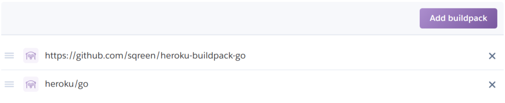
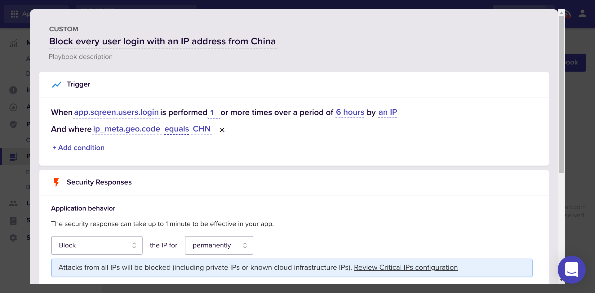

# Heroku Buildpack for Go with Sqreen

This buildpack automatically enables Sqreen for Go. It is a companion buildpack
of [Heroku's official Go Buildpack](https://github.com/heroku/heroku-buildpack-go/).

This builpack basically prepares the Go compiler options with Sqreen's tooling.
Simply add it first, before Heroku's to benefit from Sqreen for Go:

## Setup

TODO

