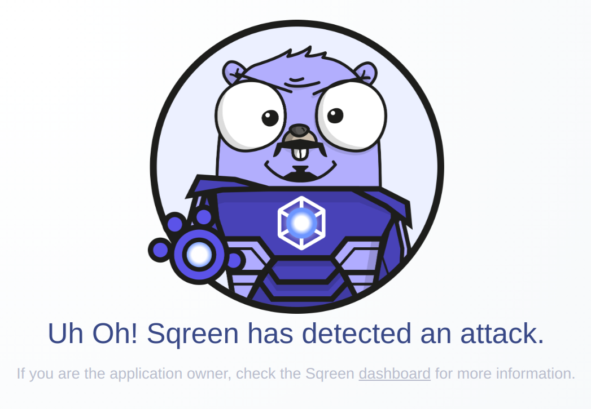

# Heroku Buildpack for Go with Sqreen

This buildpack automatically enables Sqreen for Go. It is a companion buildpack
of [Heroku's official buildpack for Go](https://github.com/heroku/heroku-buildpack-go/).

## Example

Click the following Heroku Button to deploy an Go HTTP server example protected
by Sqreen. Its source-code can be found in the `example/` directory.

## Usage

1. Add this buildpack before the official `heroku-buildpack-go`:

 
2. Add the Sqreen addon: https://elements.heroku.com/addons/sqreen

3. Add the Sqreen's HTTP middleware for your framework: https://godoc.org/github.com/sqreen/go-agent/sdk/middleware

Congratulations, your app is now protected by Sqreen!

